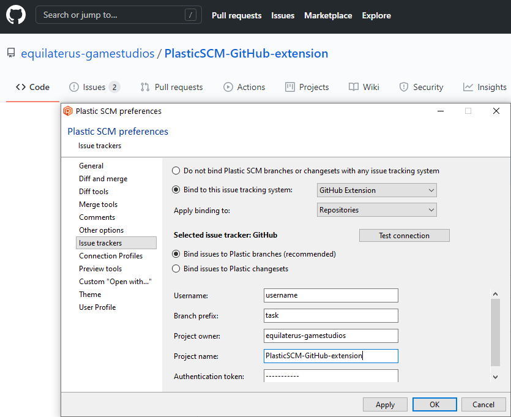
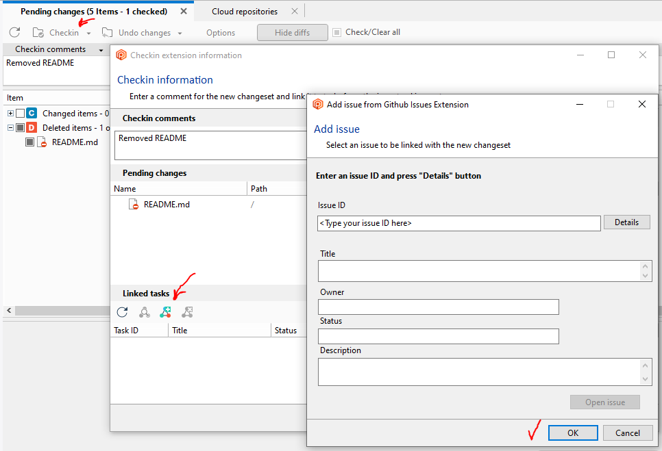
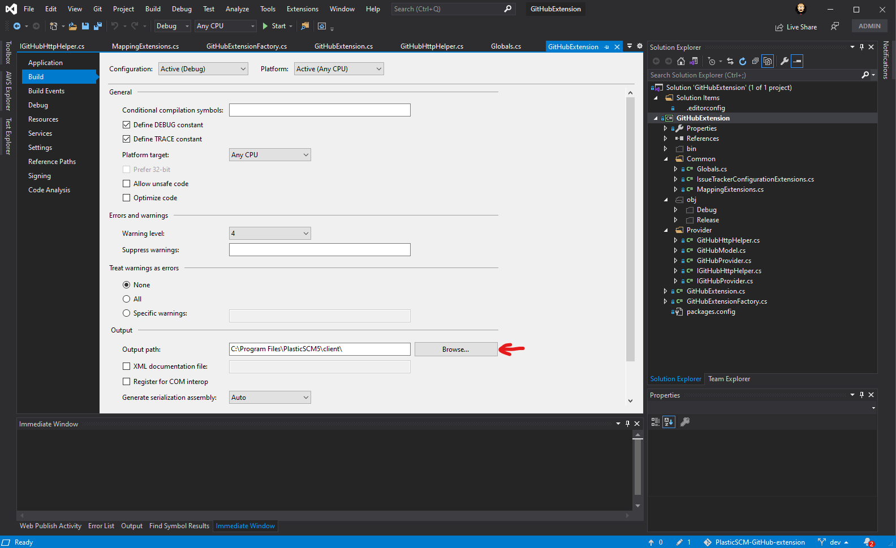

# PlasticSCM-GitHub-extension

Integrate PlasticSCM with GitHub. Access your issues directly from Plastic!

## Installation

1. Download the latest [release for Windows](https://github.com/equilaterus-gamestudios/PlasticSCM-GitHub-extension/releases) and extract the file contents inside the *client* folder of your PlasticSCM installation. Usually:

    ```
    C:\Program Files\PlasticSCM5\client
    ```

2. Run PlasticSCM, go to *Preferences* -> *Issue trackers*. You should see on the dropdown *GitHub Extension*.

    

    Configure the extension:

    * **User email**: Your email account associated with   GitHub.
    * **Branch Prefix**: By default we suggest *task*.
	* **Project owner**: User or organization account   that owns the repo (see previous image).
    * **Project name**: Repository name (see previous image).
    * **Authentication Token**: Go to [https://github.com/settings/  tokens/new](https://github.com/settings/tokens/new)   and create a *Personal token* with **repo** and **write:discussion** scopes.
	* **Plastic WebUI**: Customize the url to point to the correct path for your PlasticSCM web UI. Finally, when doing a check-in, you can link a changeset with a Github Issue (given its number ID):

	  


## Build

If you want to Build Locally this project, clone this repo and open the solution with [Visual Studio](https://visualstudio.microsoft.com/es/) as an **Administrator user**.

To see the extension on the dropdown, you'll first need to modify the file **customextensions.conf**, located on your PlasticSCM installation folder, inside **client** directory.

```
C:\Program Files\PlasticSCM5\client\customextensions.conf
```

Add the following line:

```
GitHub Extension=GitHubExtension.dll
```

In case that your PlasticSCM installation is not located on *C:\Program Files\PlasticSCM5\client*, additionally, you need to open on your text editor the file **src/GitHubExtension.csproj** (not the *.sln*!) and replace *C:\Program Files\PlasticSCM5\client* with your installation path (it appears 3 times: issuetrackerinterface.dll, log4net.dll and the OutputPath).

Finally, you'll need to double check that *Output Path* and  *Start External program* are configured to run *PlasticSCM*, see the following images:




For more information: [See PlasticSCM documentation](https://www.plasticscm.com/documentation/extensions/plastic-scm-version-control-task-and-issue-tracking-guide#WritingPlasticSCMcustomextensions).
