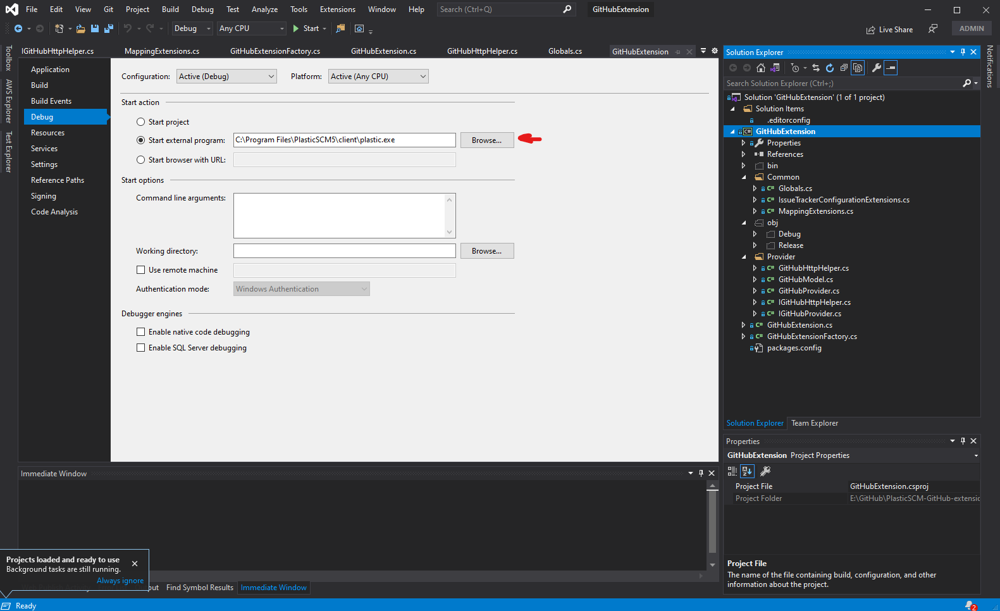

# PlasticSCM-GitHub-extension

Integrate PlasticSCM with GitHub. Access your issues directly from Plastic!

## Installation

### Extenstion Parameters

* **User email**: Your email account associated with GitHub.
* **Branch Prefix**: By default we suggest *task*.
* **Project owner**: User or organization account that owns the repository.
* **Project name**: Repository name.
* **Authentication Token**: Go to [https://github.com/settings/  tokens/new](https://github.com/settings/tokens/new)   and create a *Personal token* with **repo** and **write:discussion** scopes.
* **Plastic WebUI**: Customize the url:	   
	```
	https://www.plasticscm.com/orgs/YOUR_ORG/repos/YOUR_REPO/diff/changeset/
	```
* **Timeout**: Timeout in seconds, by default 100.
* **Linux**: true or false, enables or disables **Linux support**.

### Linux

1. Download the latest [release](https://github.com/equilaterus-gamestudios/PlasticSCM-GitHub-extension/releases) and extract file contents inside the *client* folder of your PlasticSCM installation. Usually:

    ```
    /opt/plasticscm5/client/
    ```

2. Open **$HOME/.plastic4/client.conf** and add the following line before closing the **ClientConfigData** tag of the XML contents:

  	```xml
  	<!-- Add this line -->
	<Extensions><Extension AssemblyFile="/opt/plasticscm5/client/GitHubExtension.dll" /></Extensions>
	<!-- Before closing  ClientConfigData -->
	</ClientConfigData>
	```

3. Create the structure **issuetrackers/SERVER_PORT/REPOSITORY** under **$HOME/.plastic4/**.

   * **SERVER_PORT**: Server port or *YOUR_SERVER@cloud* for cloud servers.
   * **REPOSITORY**: Name of the repository or **allrepos**.

   Example: **$HOME/.plastic4/issuetrackers/myaccount@cloud/allrepos**

4. Create a file **github.conf** inside the folders that you created under step 3. For example: **$HOME/.plastic4/issuetrackers/myaccount@cloud/allrepos/github.conf**. Customize the configuration by changing the values inside *{}* according to your requirements (remove the characters *{* and *}*):

   	```
	WorkingMode={TaskOnChangeset OR TaskOnBranch}

	Name=Username;Value={username};Type=User;IsGlobal=False
	Name=Branch prefix;Value={task};Type=BranchPrefix;IsGlobal=True
	Name=Project owner;Value={owner};Type=Text;IsGlobal=False
	Name=Project name;Value={project};Type=Text;IsGlobal=False
	Name=Authentication token;Value={token};Type=Text;IsGlobal=False
	Name=Plastic Web UI;Value={https%3A%2F%2Fwww.plasticscm.com%2Forgs%2FYOUR_ORG%2Frepos%2FYOUR_REPO%2Fdiff%2Fchangeset%2F};Type=Text;IsGlobal=False
	Name=Timeout;Value={100};Type=Text;IsGlobal=False
	Name=Linux;Value=true;Type=Boolean;IsGlobal=False
   	```

	For example:

	```
	WorkingMode=TaskOnChangeset

	Name=Username;Value=my_github_user;Type=User;IsGlobal=False
	Name=Branch prefix;Value=task;Type=BranchPrefix;IsGlobal=True
	Name=Project owner;Value=repo_owner;Type=Text;IsGlobal=False
	Name=Project name;Value=project;Type=Text;IsGlobal=False
	Name=Authentication token;Value=GITHUBTOKENHERE;Type=Text;IsGlobal=False
	Name=Plastic Web UI;Value=https%3A%2F%2Fwww.plasticscm.com%2Forgs%2Fmyorg%2Frepos%2Fproject%2Fdiff%2Fchangeset%2F;Type=Text;IsGlobal=False
	Name=Timeout;Value=100;Type=Text;IsGlobal=False
	Name=Linux;Value=true;Type=Boolean;IsGlobal=False
   	```

	For more information see **Extension Parameters** at the start of this README.

5.  Finally, when doing a check-in, you can link your PlasticSCM changeset with a Github Issue.

	

**NOTE**: You may need to use the Legacy GUI, just open PlasticSCM and go to the three dots on the top right corner of the window to switch back to the Legacy GUI.

### Windows

1. Download the latest [release](https://github.com/equilaterus-gamestudios/PlasticSCM-GitHub-extension/releases) and extract file contents inside the *client* folder of your PlasticSCM installation. Usually:

    ```
    C:\Program Files\PlasticSCM5\client
    ```

2. Run PlasticSCM, go to *Preferences* -> *Issue trackers*. You should see on the dropdown *GitHub Extension*.

    

    Configure the extension. For more information see **Extension Parameters** at the start of this README.

3. Finally, when doing a check-in, you can link your PlasticSCM changeset with a Github Issue (given its number ID):


## Build (only Windows)

If you want to Build Locally this project, clone this repo and open the solution with [Visual Studio](https://visualstudio.microsoft.com/es/) as an **Administrator user**.

To see the extension on the dropdown, you'll first need to modify the file **customextensions.conf**, located on your PlasticSCM installation folder, inside **client** directory.

```
C:\Program Files\PlasticSCM5\client\customextensions.conf
```

Add the following line:

```
GitHub Extension=GitHubExtension.dll
```

In case that your PlasticSCM installation is not located on *C:\Program Files\PlasticSCM5\client*, additionally, you need to open on your text editor the file **src/GitHubExtension.csproj** (not the *.sln*!) and replace *C:\Program Files\PlasticSCM5\client* with your installation path (it appears 3 times: issuetrackerinterface.dll, log4net.dll and the OutputPath).

Finally, you'll need to double check that *Output Path* and  *Start External program* are configured to run *PlasticSCM*, see the following images:




For more information: [See PlasticSCM documentation](https://www.plasticscm.com/documentation/extensions/plastic-scm-version-control-task-and-issue-tracking-guide#WritingPlasticSCMcustomextensions).
